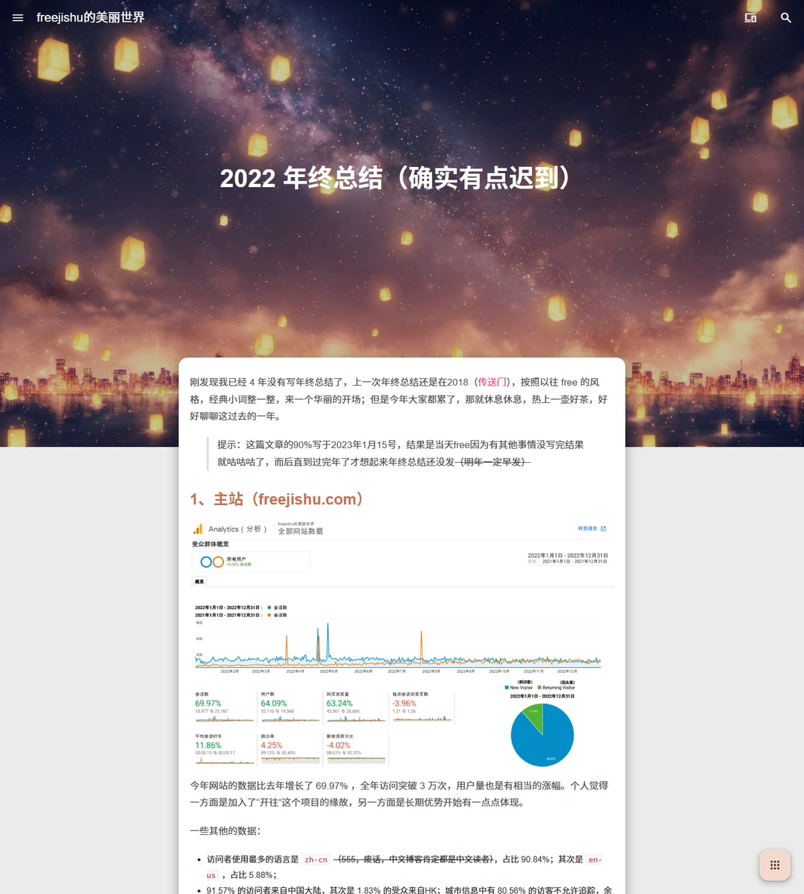

Language: English | <a title="Chinese" href="README/zh_CN.md">Chinese</a> | <a title="Turkish" href="README/tr_TR.md">Turkish</a>

 

<h1 align="center"><a href="https://github.com/freejishu/wordpress-mdx-next" target="_blank">MDx Next</a></h1>

> Looks light, power inside.

## Contents

- [Contents](#contents)
- [Introduction](#introduction)
- [What's New in MDx Next](#whats-new-in-mdx-next)
- [Demo](#demo)
- [Download](#download)
- [Internationalization](#internationalization)
- [Docs](#docs)
- [License](#license)
- [Render](#render)

## Introduction

MDx Next is a light, elegant and powerful WordPress theme with Material Design — a derivative of [MDx](https://github.com/yrccondor/mdx) 2.0.4 by [AxtonYao](https://flyhigher.top), continued under the GPL-3.0 license with Material Design 3 (Material You) support and a set of fixes and enhancements.

Key features (inherited from MDx):

- Completely designed in Material Design, with Material Design 1 / 2 / 3 styles switchable in one click
- 4 index styles, 5 post list styles, 3 footer styles & 4 page styles
- 20 theme colors & 16 accent colors (classic styles), or a fully derived MD3 tonal palette
- Night mode and Always-Dark mode with optional OLED optimization
- SEO friendly, easily share on Facebook / Twitter
- Fast and light, no jQuery dependency
- Share your work with the beautiful share card
- Built-in TOC, image light box and 7 shortcodes
- Multi-language support (Simplified Chinese, Traditional Chinese (Taiwan), Traditional Chinese (Hong Kong), Turkish & English)
- ✨ Interactive search
- ✨ Easily continue reading cross-platformly

## What's New in MDx Next

Compared with upstream MDx 2.0.4:

- 🎨 **Material Design 3 (Material You) style layer** — a unified MD1 / MD2 / MD3 style selector in the admin panel; classic styles remain fully intact
- 🌱 **Seed color** — pick any color with the native color picker; the whole site's tonal palette (light & dark) is derived from it via `color-mix()`
- 🖼️ **Optional dynamic color** — extract the theme color from the first-page image automatically (with graceful fallback)
- 🌗 **Adaptive on-color** — text on colored surfaces automatically switches between light and dark based on luminance
- 🧭 **Themed scrolled toolbar & reading ring** — the toolbar turns solid seed color after scrolling with adaptive text, and the reading progress ring follows the theme color
- 🟦 **MD3 article images** — optional 12px rounded corners for in-article images (MD3 only, inline style, no cache issue)
- 🔧 **Fixes & enhancements** — SEO and sharing fixes, video background support, friend-links 4-column layout, imgbox fix from upstream

## Demo

- [freejishu 的美丽世界](https://www.freejishu.com)

## Download

You can download MDx Next from [Releases](https://github.com/freejishu/wordpress-mdx-next/releases), or use **Code → Download ZIP** to get the latest `main` branch. **DO NOT `clone` this repository just for downloading.**

After downloading, upload the theme directory to `wp-content/themes/` and enable it in Appearance → Themes.

## Internationalization

MDx Next supports multi-language. Default language is simplified Chinese.

Supported language(s):

- Chinese (Simplified)
- Turkish (Thanks [Hasan CAN](https://github.com/Sn0bzy))
- English (Thanks [Ye Shu](https://github.com/yechs))
- Traditional Chinese (Taiwan) (Thanks [AngelKitty](https://github.com/AngelKitty))
- Traditional Chinese (Hong Kong)

> You can help us to translate MDx Next into other languages!

## Docs

MDx Next shares most of its options with MDx, so the [MDx Docs](https://doc.flyhigher.top/mdx/) still apply. MDx Next specific options (style selector, seed color, dynamic color, article image corner radius, etc.) can be found in the MDx theme settings panel in the WordPress admin.

## License

Open sourced under the GPL v3.0 license. MDx Next is a derivative work of [MDx](https://github.com/yrccondor/mdx) by [AxtonYao](https://flyhigher.top), which is also licensed under GPL v3.0.

## Render

